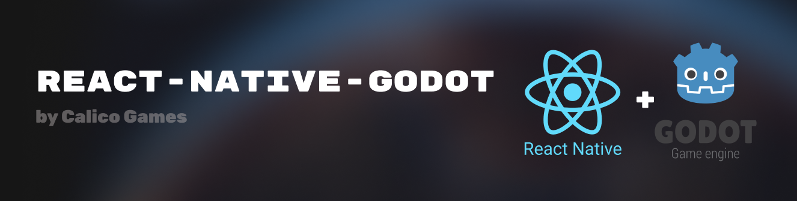

<picture>
  
</picture>

<br />

# React Native Godot

Bring **Godot** to **React Native** 🔮. Create immersive 3D experiences or interactive games directly within React Native, allowing for high-performance graphics and responsive interactions.

[](https://www.npmjs.com/package/react-native-godot)
[](https://godotengine.org/download)

## Table of Contents

- [Screenshots](#screenshots)
- [Features](#features)
- [Device Support](#device-support)
- [Requirements](#requirements)
- [Installation](#installation)
- [Quick Start](#quick-start)
- [API Reference](#api-reference)
  - [Godot Variants](#godot-variants)
  - [Runtime GDScript & Node Creation](#runtime-gdscript-node-creation)
  - [Scene Node Access](#scene-node-access)
  - [React Native ↔ Godot Communication](#react-native-godot-communication)
- [Project Setup](#project-setup)
  - [Importing Godot Projects](#importing-godot-projects)
  - [Metro Configuration](#metro-configuration)
- [Limitations & Known Issues](#limitations-known-issues)
- [Contributing](#contributing)
- [License](#license)

## <a id="screenshots"></a>Screenshots 📸

[](screenshots/screenshot1.jpeg)
[](screenshots/screenshot2.jpeg)

## <a id="features"></a>Features 🚀

- 🏎️ **Native C++ JSI performance** - Direct JavaScript to native bindings
- 🔥 **GPU-accelerated rendering** - Metal (iOS) and OpenGL/Vulkan support
- ✅ **Full React Native compatibility** - Supports old and new architecture
- 🎮 **Complete Godot integration** - Access all Godot variants and features
- 🧙‍♂️ **Runtime GDScript compilation** - Create and execute scripts dynamically
- 📦 **Easy project import** - Simple workflow to bring Godot projects to RN
- 🔄 **Bidirectional communication** - React Native ↔ Godot messaging

## <a id="device-support"></a>Device Support 📱

iOS support is implemented, full Android support is coming soon.

| Platform         | Supported |
| ---------------- | --------- |
| iOS Device       | ✅        |
| iOS Simulator    | ❌        |
| Android Device   | 🚧        |
| Android Emulator | 🚧        |

## <a id="requirements"></a>Requirements 🥸

- Godot 4.4.1 ([https://godotengine.org/](https://godotengine.org/))
- React Native 0.70+
- iOS 12.0+ / Android API 21+

## <a id="installation"></a>Installation 🚀

```bash
npm install react-native-godot
# or
yarn add react-native-godot
```

## <a id="quick-start"></a>Quick Start 👇

### 1. Setup GodotProvider

Wrap your app with `GodotProvider` to initialize Godot properly:

```tsx
// App.tsx
import React from 'react';
import { GodotProvider } from 'react-native-godot';
import MyGameScreen from './MyGameScreen';

export default function App() {
  return (
    <GodotProvider>
      <MyGameScreen />
    </GodotProvider>
  );
}
```

### 2. Create your game component

```tsx
// MyGameScreen.tsx
import React, { useEffect, useState } from 'react';
import { GodotView, useGodot, useGodotRef } from 'react-native-godot';

const MyGameScreen = () => {
  const godotRef = useGodotRef();
  const { Vector3, Vector2 } = useGodot();
  const [isGodotReady, setIsGodotReady] = useState(false);

  useEffect(() => {
    if (!isGodotReady || !godotRef.current?.isReady) {
      return;
    }

    // Use Godot variants
    const position = Vector3(1, 2, 3);
    console.log('Position Y:', position.y);

    // Get nodes from your scene
    const playerNode = godotRef.current.getRoot()?.getNode('Player');
    playerNode?.call('jump', 10);

    // Send data to Godot
    godotRef.current.emitMessage({
      type: 'player_spawn',
      position: position,
      health: 100
    });

  }, [isGodotReady]);

  return (
    <GodotView
      ref={godotRef}
      style={{ flex: 1 }}
      source={require('./assets/game.pck')}
      scene="res://main.tscn"
      onReady={() => setIsGodotReady(true)}
      onMessage={(instance, message) => {
        console.log('Message from Godot:', message);
      }}
    />
  );
};

export default MyGameScreen;
```

## <a id="api-reference"></a>API Reference

### <a id="godot-variants"></a>Godot Variants 🍭

All Godot variant types are available with full method and property support:

**Available Types:**
`AABB | Basis | Color | Plane | Projection | Quaternion | Rect2 | Rect2i | Transform2D | Transform3D | Vector2 | Vector2i | Vector3 | Vector3i | Vector4 | Vector4i`

**Usage:**

```tsx
const { Vector3, Color, Transform3D } = useGodot();

// Create variants
const position = Vector3(1, 2, 3);
const color = Color(1, 0, 0, 1); // Red
const transform = Transform3D();

// Use methods and properties
console.log('Distance:', position.length());
console.log('Normalized:', position.normalized());
console.log('Red component:', color.r);

// Automatic conversion for primitives
const data = {
  score: 100,           // int
  name: "Player",       // String
  active: true,         // bool
  items: [1, 2, 3],    // Array
  stats: { hp: 100 }   // Dictionary
};
```

Complete documentation: [Godot Variant Types](https://docs.godotengine.org/en/stable/classes/index.html#variant-types)

### <a id="runtime-gdscript-node-creation"></a>Runtime GDScript & Node Creation 🧙‍♂️

Create and compile GDScript at runtime, then attach to dynamically created nodes:

```tsx
const { Script, Node } = useGodot();

// Create and compile a script
const script = Script();
const success = script.setSourceCode(`
extends Node

@onready var health = 100

func _ready():
    print("Dynamic script loaded!")

func take_damage(amount: int) -> int:
    health -= amount
    return health

func heal(amount: int):
    health += amount
    print("Healed for ", amount, " HP")
`);

if (success) {
  // Create node and attach script
  const dynamicNode = Node();
  dynamicNode.setScript(script);
  dynamicNode.setName("DynamicPlayer");
  
  // Add to scene
  godotRef.current?.getRoot()?.addChild(dynamicNode);
  
  // Call script methods
  const remainingHealth = dynamicNode.call("take_damage", 25);
  console.log('Health remaining:', remainingHealth);
  
  // Alternative syntax with TypeScript casting
  (dynamicNode as any).heal(10);
}
```

#### Script API

| Method | Description |
|--------|-------------|
| `Script()` | Create a new empty script |
| `setSourceCode(source: string): boolean` | Set and compile GDScript source code |

#### Node API

| Method | Description |
|--------|-------------|
| `Node()` | Create a new empty node |
| `getNode(path: string): Node \| null` | Get child node by path |
| `getParent(): Node \| null` | Get parent node |
| `getChildren(): Node[]` | Get all child nodes |
| `getChildCount(): number` | Get number of child nodes |
| `addChild(child: Node)` | Add a child node |
| `setName(name: string)` | Set the node's name |
| `setScript(script: Script)` | Attach a script to the node |
| `call(method: string, ...args: any[]): any` | Call a method defined in the attached script |

**💡 Tip:** For better TypeScript ergonomics, you can call script methods directly using `(node as any).methodName(args)` instead of `node.call("methodName", args)`.

### <a id="scene-node-access"></a>Scene Node Access 🎯

Access and interact with nodes from your loaded Godot scenes:

```tsx
useEffect(() => {
  if (!godotRef.current?.isReady) return;

  // Get the root node
  const root = godotRef.current.getRoot();
  
  // Navigate the scene tree
  const player = root?.getNode('Player');
  const ui = root?.getNode('UI/HealthBar');
  
  // Access node hierarchy
  const parent = player?.getParent();
  const children = player?.getChildren();
  const siblingCount = parent?.getChildCount();
  
  // Call methods defined in the node's GDScript
  player?.call('set_health', 100);
  ui?.call('update_display', 100, 100);
  
  // Alternative direct method calls
  (player as any)?.jump(15);
  (ui as any)?.show_damage_effect();
  
}, [godotRef.current?.isReady]);
```

### <a id="react-native-godot-communication"></a>React Native ↔ Godot Communication 📡

#### React Native → Godot

Send messages from React Native to your Godot scripts:

```tsx
// Send structured data to Godot
godotRef.current?.emitMessage({
  type: 'player_action',
  action: 'attack',
  target: 'enemy_1',
  position: Vector3(10, 0, 5),
  damage: 50
});
```

#### Godot → React Native

Receive messages in React Native from Godot scripts:

```tsx
<GodotView
  onMessage={(instance, message) => {
    console.log('Received from Godot:', message);
    
    // Handle different message types
    switch (message.type) {
      case 'game_over':
        showGameOverScreen(message.score);
        break;
      case 'level_complete':
        advanceToNextLevel();
        break;
      case 'item_collected':
        updateInventory(message.item);
        break;
    }
  }}
/>
```

#### Godot Script Implementation

```gdscript
extends Node

@onready var rn_singleton = Engine.get_singleton("ReactNative")

func _ready():
    if rn_singleton:
        # Listen for messages from React Native
        rn_singleton.on_message(_on_react_native_message)

func _on_react_native_message(message: Dictionary):
    print("Message from React Native: ", message)
    
    match message.type:
        "player_action":
            handle_player_action(message)
        "game_state_change":
            update_game_state(message.state)

func send_to_react_native(data: Dictionary):
    if rn_singleton:
        rn_singleton.emit_message(data)

func _on_enemy_defeated():
    send_to_react_native({
        "type": "enemy_defeated",
        "enemy_id": "goblin_1",
        "exp_gained": 50
    })
```

## <a id="project-setup"></a>Project Setup

### <a id="importing-godot-projects"></a>Importing Godot Projects 📥

To use your existing Godot project in React Native:

1. **Add export preset configuration**

  Create `export_presets.cfg` in your Godot project directory:

  ```ini
  [preset.0]

  name="main"
  platform="iOS"
  runnable=true
  advanced_options=false
  dedicated_server=false
  custom_features=""
  export_filter=""
  include_filter="project.godot"
  exclude_filter=""
  export_path=""
  encryption_include_filters=""
  encryption_exclude_filters=""
  encrypt_pck=false
  encrypt_directory=false
  script_export_mode=2

  [preset.0.options]

  export/distribution_type=1
  binary_format/architecture="universal"
  binary_format/embed_pck=false
  custom_template/debug=""
  custom_template/release=""
  debug/export_console_wrapper=0
  display/high_res=true
  ```

2. **Generate PCK file**

  Run the provided script (modify path for your OS):

  ```bash
  ./gen-pck PROJECT_FOLDER_PATH
  ```

3. **Add to React Native project**

  Move the generated `.pck` file to your React Native `assets` folder.

4. **Include project.godot in iOS**

  Add your `project.godot` file to your Xcode project bundle.

### <a id="metro-configuration"></a>Metro Configuration 🚇

Add PCK file support to your `metro.config.js`:

```js
const config = getDefaultConfig(__dirname);

// Add pck files as assets
config.resolver.assetExts.push('pck');

module.exports = config;
```

## <a id="limitations-known-issues"></a>Limitations & Known Issues 🚧

### Texture Import Settings

When importing textures or 3D models, avoid using `VRAM Compressed` format as it may not export properly in PCK files.

[](screenshots/screenshot3.png)

### PCK Asset Swapping

Currently, you cannot swap PCK assets at runtime. You need to restart the app to load a new PCK file. This appears to be a Godot engine limitation that we're investigating.

### Platform Support

- iOS Simulator is not supported due to architecture differences
- Android support is in development

## <a id="contributing"></a>Contributing 🤝

We welcome contributions! The core development happens in a private repository, but if you'd like to contribute:

1. Open an issue to discuss your idea
2. Contact us at `team@calico.games` for access to the private repo
3. Experience with Godot Engine, C++, and React Native is preferred
4. Knowledge of [Bazel](https://github.com/bazelbuild/bazel) is a plus

## <a id="license"></a>License 👨‍⚖️

**Copyright Calico Games 2024. All rights reserved.**

This library is released under a **Custom License**:

- **✅ Free for non-commercial use** - Personal, educational, or open-source projects
- **💼 Commercial use requires license** - Companies/individuals with >$50,000 annual revenue need a commercial license
- **❌ No redistribution** - Cannot be redistributed, repackaged, or resold

We support the Godot Foundation by sharing revenue from commercial licenses.

For commercial licensing: `team@calico.games`

---

## <a id="credits"></a>Credits 🙏

- Special thanks to the [Godot Engine](https://github.com/godotengine/godot) contributors
- Huge appreciation to [Migeran](https://github.com/migeran) for their invaluable help
