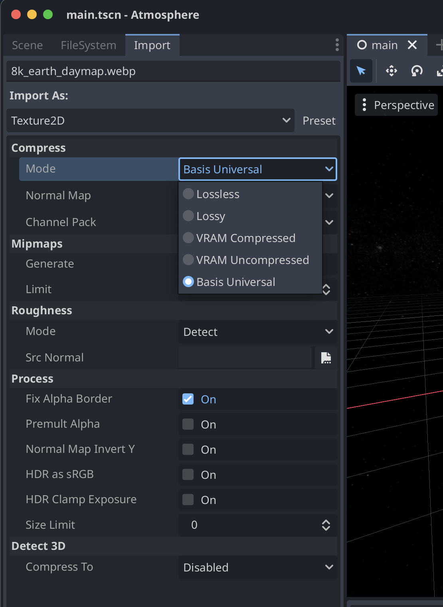

# React Native Godot

[](https://www.npmjs.com/package/react-native-godot)
[](https://godotengine.org/download)

Bring **Godot** to **React Native** 🔮.

## Screenshots

[](screenshots/screenshot1.jpeg)
[](screenshots/screenshot2.jpeg)

### Features

**react-native-godot** is a library that allows you to use Godot in your React Native app.

* 🏎️ Native C++ JSI performance
* 🔥 GPU-accelerated by Metal and OpenGL/Vulkan
* ✅ Supports old and new arch
* 🙂 Support Godot Variants in React Native `AABB | Basis | Color | Plane | Projection | Quaternion | Rect2 | Rect2i | Transform2D | Transform3D | Vector2 | Vector2i | Vector3 | Vector3i | Vector4 | Vector4i`

## Device Support

iOS support is implemented, full support for Android is almost ready.
We'll ship that soon 😊

| Platform         | Supported |
| ---------------- | --------- |
| iOS Simulator    | ✅        |
| iOS Device       | ✅        |
| Android Emulator | 🚧        |
| Android Device   | 🚧        |

## Requirements

* Godot 4.3 ([https://godotengine.org/](https://godotengine.org/))

## Installation

```sh
npm install react-native-godot

or

yarn add react-native-godot
```

## Usage

Take a look at the `example` folder for a full implem 👀.

### Godot Variants

Godot variants are available in React Native, here is the list:
`AABB | Basis | Color | Plane | Projection | Quaternion | Rect2 | Rect2i | Transform2D | Transform3D | Vector2 | Vector2i | Vector3 | Vector3i | Vector4 | Vector4i`.

For primitives like `int`, `float`, `bool`, `dictionary`, `array`, etc, you can use normal JS types and it will be automatically converted to Godot variants and vice versa.

All methods and properties are available too, for instance, you can use `Vector3(1, 2, 3).length()`.
Complete documentation is available at [https://docs.godotengine.org/en/stable/classes/index.html#variant-types](https://docs.godotengine.org/en/stable/classes/index.html#variant-types).

### React Native <-> Godot

You can send messages from React Native to Godot and receive messages from Godot in React Native.

* **React Native -> Godot**: You can send messages from React Native to Godot using the `emitMessage` method.
* **Godot -> React Native**: You can receive messages from Godot in React Native using the `onMessage` prop.

```tsx
// GodotProvider => <GodotProvider><Example /><GodotProvider/> is required to use Godot, it should be at the root of your app (the highest level is recommended. e.g. App.tsx)

import React, {useRef} from 'react';
import {Godot, GodotView, GodotProvider, useGodot} from 'react-native-godot';

const Example = () => {
 const godotRef = useRef<GodotView>(null);
 const {Vector3, Vector2} = useGodot(); 

 useEffect(() => {
    // Emit a message to Godot from React Native
    godotRef.current?.emitMessage({
      message: 'Hello from React Native!',
      position: Vector3(1, 2, 3),
    });

    // Use Godot Vector3 and Vector2 variants
    // All methods and properties are available too :)
    console.log('Vector3 y:', Vector3(1, 2, 3).y);
    console.log('Length', Vector2(3, 1).length());
  }, []);

  return (
    <Godot
      ref={godotRef}
      style={{flex: 1}}
      source={require('./assets/game.pck')}
      scene="res://main.tscn"
      {/* Receive messages from Godot */}
      onMessage={(message) => console.log('Godot message:', message)}
    />
  );
};
```

### Godot implementation

```gdscript
# This class is a demonstration of GDScript with React Native.

extends Node

func _ready() -> void:
  if Engine.has_singleton("ReactNative"): # Always check if the ReactNative singleton exists
    Engine.get_singleton("ReactNative").on_receive_message(_on_receive_message)

func _on_receive_message(message: Dictionary) -> void:
  print("React Native message:", message)

func _input(event: InputEvent) -> void:    
  if "position" not in event:
    return

  var adjusted_position = adjust_for_window(event.position)

  if Engine.has_singleton("ReactNative"):
    # Emit a message to React Native
    Engine.get_singleton("ReactNative").emit_message({
      "message": "Input event position",
      "pos": adjusted_position,
    })

## This function is used to adjust the screen position for the window.
func adjust_for_window(pos: Vector2) -> Vector2:
  var window = get_viewport().get_window()
  var window_id = window.get_window_id()

  if window_id == DisplayServer.MAIN_WINDOW_ID or window_id == DisplayServer.INVALID_WINDOW_ID:
    return pos

  var window_position = Vector2()

  if Engine.has_singleton("ReactNative"):
    window_position = Engine.get_singleton("GDReactNative").get_subwindow_position(window_id)

  return Vector2(
    pos.x + window_position.x,
    pos.y + window_position.y
  )
```

## Godot (How to)

* To import your **Godot project** into react-native, you need to **generate a pck file** that basically packs up all your game assets, scripts etc.
It's a convenient way to pack your game into a single file.

* First, you need to add a `export_presets.cfg` in the directory of your Godot project.
We provide a working example of this file at the root of this repository.

* After that, you're now able to generate a pck file, just run `./gen-pck PROJECT_FOLDER_PATH`.
Be sure you have `/Applications/Godot.app` set on your machine, if you're using another path or another OS than macOS, just modify this very simple shell at your convenience.

* Then, you just need to move the pck file in your assets folder.

* One last thing, add a `project.godot` in your assets with the pck, see in the example folder for more details.

## Metro

* You need to add the following to your `metro.config.js` in order to treat `.pck` files as assets and exclude them from being treated as source files.

```js
// Treat `.pck` files as assets
assetExts: [...assetExts, 'pck'],
// Exclude `.pck` from being treated as source files
sourceExts: sourceExts.filter(ext => ext !== 'pck'),
```

And...

```js
server: {
  enhanceMiddleware: (middleware) => {
    return (req, res, next) => {
      if (/\.pck$/.test(req.url)) {
        res.setHeader('Content-Type', 'application/octet-stream');
      }
      return middleware(req, res, next);
    };
  },
},
```

## Library Size

The Godot engine is quite large, so the library size is also quite large too 😅.

Godot with all features enabled is around 140MB for iOS (arm64).
`godot-cpp` bindings is around 60MB, which is used to communicate with the Godot engine from React Native.
So for now, it's around 200MB for iOS (arm64), we might be able to reduce this size in the future.

For example by disabling features that are not needed, removing `MoltenVK` for iOS in Godot 4.4 (which is around 9MB), not depending on `godot-cpp` by forking the engine completely, etc.
Also, your pck file must be considered in the size of your app. Which can be quite large too if you have a lot of big assets like 3D models, textures, etc.

## Limitations & Known Issues

* When importing a texture or 3D model, be sure you don't import them as `VRAM Compressed`, for some reason when exporting the pck file, it doesn't import the assets. Might be a mistake from our side.... (TBD) 😅

[](screenshots/screenshot3.png)

* **PCK Asset Swapping**: For now, you can't swap the pck asset at runtime properly, you need to reopen the app to load a new pck asset. It seems to be a limitation of the Godot engine itself, but we're investigating this as it would be super useful to debug on device in almost real-time.

## TODO

* [x] iOS support
* [ ] Android support
* [x] Improve library size
* [x] Add support for all Godot variants
* [ ] Investigate PCK asset swapping
* [ ] Add support for more Godot features

## Contributing

We're open to any contributions. Feel free to open an issue if you want to help us improve this library.

All the interesting stuff is located in a private repository so if you want to contribute, just send us an email at `team@calico.games`.
You should have previous experiences of building the Godot Engine yourself, C++, and building blazing fast React Native libraries is a plus.
[Bazel](https://github.com/bazelbuild/bazel) is also used internally to build the library fyk.

## Copyright / License

Copyright **Calico Games** 2024. All rights reserved.

This library is released under a **Custom License** with the following conditions:

* **Free for non-commercial use**: You may freely use this library for personal, educational, or open-source projects.
* **Commercial use by revenue-generating entities**: Any company or individual with an annual revenue exceeding $50,000 must obtain a commercial license to use this library.
* **No Redistribution Allowed**: This library cannot be redistributed, repackaged, or resold.

PS: We are pretty flexible atm and we would like to also support the Godot Foundation by giving them a share of the revenue generated by this library.

For commercial licensing inquiries, please contact us at `team@calico.games`.

## Credits

* Special thanks to all the contributors of the [Godot Engine](https://github.com/godotengine/godot).
* A big shoutout to [Migeran](https://github.com/migeran) that helped us a lot to build this library.
